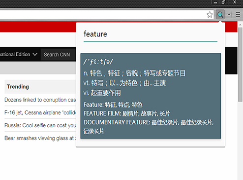
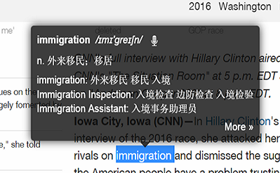

# YoudaoDict

自制有道词典 Chrome 扩展，使用[有道词典 api](http://fanyi.youdao.com/openapi)

## Install 安装

* 去 [Chrome 官方商店](https://chrome.google.com/webstore/detail/youdao-dict/geboigdomoihijcamklnhlcgnnpdgkmg)安装。

* 下载 [crx 文件](https://github.com/youngdze/YoudaoDict/blob/master/release/YoudaoDic.crx?raw=true)安装。

## 使用

点击扩展图标输入进行翻译

双击或按 Ctrl 对选择区域进行翻译

设置

## 版权

* DO WHATEVER YOU WANT